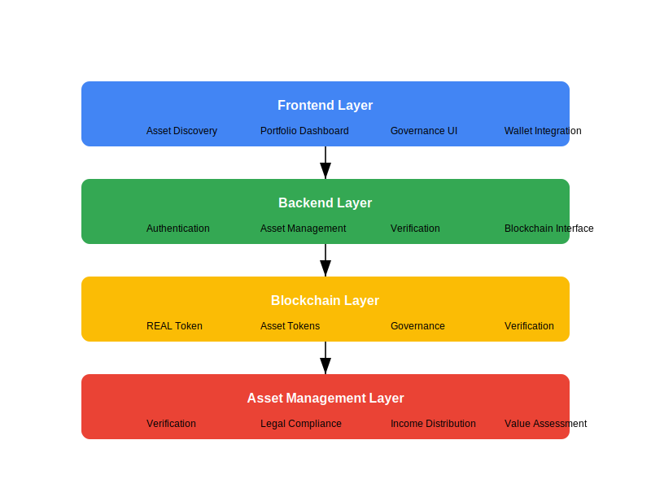

# RealStack - Real-World Asset Tokenization Platform

<div align="center">
  
  
  [](https://opensource.org/licenses/MIT)
  [](https://realstack.xyz)
  [](https://x.com/RealStack_xyz)
</div>

## 🔑 Overview

RealStack bridges the gap between traditional physical assets and blockchain technology by providing a decentralized platform for real-world asset (RWA) tokenization on the Solana blockchain. Our platform enables fractional ownership, enhanced liquidity, and transparent management of traditionally illiquid assets.

### Key Features

- **Asset Tokenization**: Convert real-world assets into on-chain tokens
- **Fractional Ownership**: Invest in high-value assets with minimal capital
- **Liquidity Enhancement**: Trade tokenized assets on secondary markets
- **Transparent Verification**: Rigorous multi-stage verification process
- **Decentralized Governance**: Community-driven decision making via REAL token
- **Low Fees**: Leverage Solana's high throughput and low transaction costs

## 🚀 Quick Start

### Prerequisites

- Node.js (v16+)
- Rust (v1.65+)
- Solana CLI (v1.16+)
- Anchor Framework (v0.27+)
- A Solana wallet with SOL for transaction fees

### Installation

```bash
# Clone the repository
git clone https://github.com/RealStack-xyz/realstack.git
cd realstack

# Install dependencies
npm install

# Configure environment
cp .env.example .env
# Edit .env with your configuration

# Build the Solana program
cd contracts
anchor build

# Deploy the program (on devnet for testing)
anchor deploy --provider.cluster devnet

# Run the frontend development server
cd ../apps/frontend
npm run start

# In a separate terminal, run the backend
cd ../backend
npm run dev
```

Visit `http://localhost:3000` to access the application.

## 🏗️ Architecture

RealStack consists of four primary layers working together to provide a complete tokenization ecosystem:

<div align="center">
  
</div>

### Frontend Layer
React-based user interface providing:
- Asset browsing and discovery
- Portfolio management dashboard
- Governance participation interface
- Wallet integration (Phantom, Solflare)

### Backend Layer
Node.js services handling:
- User authentication and authorization
- Asset metadata management
- Verification workflow orchestration
- Blockchain transaction preparation

### Blockchain Layer
Solana smart contracts managing:
- REAL governance token
- Asset token creation and management
- Decentralized governance mechanisms
- Verifier reputation system

### Asset Management Layer
Process-based systems for:
- Physical asset verification
- Legal compliance and documentation
- Income distribution from revenue-generating assets
- Value assessment and monitoring

## 📊 Token Economics

The REAL token is the governance and utility token of the RealStack platform:

- **Total Supply**: 100,000,000 REAL
- **Distribution**:
  - Community (40%): 40,000,000 REAL
  - Asset Acquisition Reserve (25%): 25,000,000 REAL
  - Development Fund (20%): 20,000,000 REAL
  - Liquidity Provision (10%): 10,000,000 REAL
  - Team and Advisors (5%): 5,000,000 REAL

REAL token provides utility for:
- Platform governance voting
- Fee discounts for transactions
- Staking rewards and benefits
- Verification services

## 🔍 Asset Verification

RealStack implements a rigorous multi-stage verification process:

1. **Initial Submission**: Documentation collection and preliminary review
2. **Expert Assessment**: Industry-specific expert evaluation
3. **Valuation Confirmation**: Formal appraisal and value determination
4. **Legal Verification**: Title, ownership, and compliance check
5. **Tokenization Approval**: Final review and approval
6. **Ongoing Verification**: Regular reassessment and updates

For details, see our [Asset Verification Documentation](docs/en/asset_verification.md).

## 🏛️ Governance

The RealStack governance system enables token holders to participate in platform decision-making:

- **Proposal Creation**: Submit proposals for platform changes
- **Discussion Period**: Community deliberation on proposals
- **Voting Period**: Token-weighted voting on proposals
- **Execution**: Automatic or manual implementation of approved changes

For details, see our [Governance Framework](docs/en/governance.md).

## 🔌 API Reference

RealStack provides a comprehensive API for developers to build on top of our platform:

```javascript
// Example: Retrieve asset details
const { RealStackClient } = require('@realstack/sdk');

const client = new RealStackClient({
  apiKey: 'your-api-key',
  environment: 'production'
});

async function getAssetDetails(assetId) {
  const asset = await client.assets.get(assetId);
  console.log(asset);
}
```

For complete API documentation, see our [API Reference](docs/en/api_reference.md).

## 📁 Project Structure

```
RealStack/
├── apps/                         # Application code
│   ├── frontend/                 # React frontend
│   └── backend/                  # Node.js backend
├── contracts/                    # Solana smart contracts
├── docs/                         # Documentation
├── scripts/                      # Utility scripts
└── shared/                       # Shared libraries and types
```

## 📅 Roadmap

### Phase 1: Foundation (Q3 2023)
- ✅ Platform development and security audits
- ✅ Legal framework establishment
- ✅ Pump.fun launch preparation
- ✅ Advisory board formation

### Phase 2: Market Entry (Q4 2023)
- 🔄 Pump.fun token launch
- 🔄 First asset tokenization showcase
- 🔄 Liquidity incentive program deployment
- 🔄 Basic governance activation

### Phase 3: Expansion (Q1-Q2 2024)
- ⏳ Asset category diversification
- ⏳ Additional trading venue integration
- ⏳ Cross-chain compatibility
- ⏳ Enhanced analytics dashboard

### Phase 4: Maturity (Q3 2024-Q2 2025)
- ⏳ New asset classes governed by community
- ⏳ Institutional partnerships
- ⏳ Advanced yield strategies
- ⏳ Regulated security token offering exploration

## 🛠️ Development

### Testing

```bash
# Run frontend tests
cd apps/frontend
npm test

# Run backend tests
cd ../backend
npm test

# Run contract tests
cd ../../contracts
anchor test
```

### Code Style

We use ESLint and Prettier for JavaScript/TypeScript code quality:

```bash
# Check code style
npm run lint

# Automatically fix issues
npm run lint:fix
```

## 🤝 Contributing

We welcome contributions from the community! Please read our [Contributing Guidelines](CONTRIBUTING.md) before submitting pull requests.

### Development Workflow

1. Fork the repository
2. Create a feature branch (`git checkout -b feature/amazing-feature`)
3. Commit your changes (`git commit -m 'Add amazing feature'`)
4. Push to the branch (`git push origin feature/amazing-feature`)
5. Open a Pull Request

## ❓ FAQ

### What assets can be tokenized on RealStack?
RealStack supports various asset classes including real estate, art, vehicles, business equity, collectibles, and more. Each asset class has specific verification requirements.

### How are tokenized assets legally structured?
Each tokenized asset is typically structured as a Special Purpose Vehicle (SPV) or similar legal entity that holds the asset. Tokens represent ownership shares in this entity.

### What happens if an asset is damaged or destroyed?
All assets are required to have appropriate insurance coverage. If an asset is damaged or destroyed, the insurance proceeds are distributed to token holders proportionally.

### How are income-generating assets handled?
For assets that generate income (like rental properties), the income is distributed to token holders on a regular schedule, minus management fees and reserves.

## 📜 License

This project is licensed under the MIT License - see the [LICENSE](LICENSE) file for details.

## 📞 Contact

- Website: [realstack.xyz](https://realstack.xyz)
- Email: info@realstack.xyz
- Twitter: [@RealStack_xyz](https://x.com/RealStack_xyz)

---

Built with ❤️ by the RealStack Team 